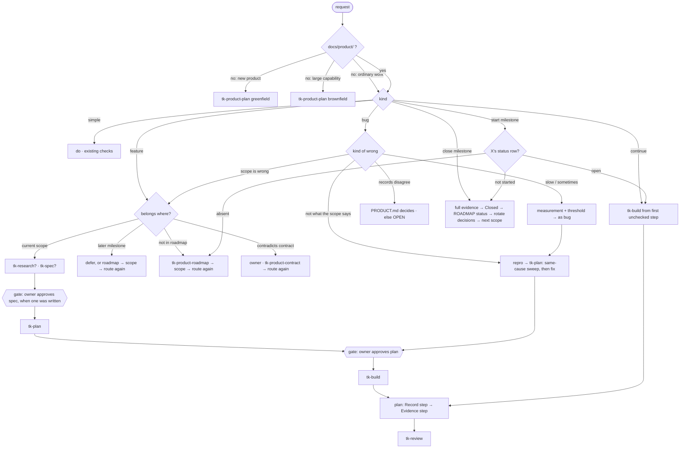

# Workflow

<!--
This is the project's routing. It was copied from the tk-workflow skill's default
and it is the copy that RUNS: the skill reads this file, not its own. Edit it to
fit the project — add a row, move where a kind of request starts, tighten a rule,
add a column for a ticket id. Keep it to about one screen; a routing nobody
reads routes nothing. Delete these comments once the file is yours.
-->

## Before any task

1. Find the **current milestone**: the first row of the status table at the
   top of `ROADMAP.md` that is not closed — read the table, not the whole
   file; a milestone's section is for the rows that place features or close
   milestones. Its `Scope` column names the current scope file; if that file
   does not exist, a close was left unfinished — say so to the owner, and
   the rows below that read the scope stop at `tk-milestone-scope` until it
   exists. No `ROADMAP.md` → there is no product layer yet; the code and
   its tests are the truth.
2. Read `DECISIONS.md` — the whole file is the tail: closing a milestone
   rotates its entries to `decisions/<id>.md`, and the contract and scopes
   already carry what those entries settled. An entry whose milestone id
   the status table shows `closed` is a close left unfinished: rotate it
   (and the milestone's `ROADMAP.md` section, if one is still there) into
   `decisions/<id>.md` now, before routing — mechanical, no gate.
3. Route with the table. When in doubt between two rows, take the heavier one
   and say so — a feature treated as a simple task is the expensive mistake,
   not the reverse.

## Routing

| Request looks like | Read first | Start at | Ends by recording | Reply |
|---|---|---|---|---|
| **"Continue" / "where were we"** | `ls .ai/*/plan.md`; the newest with an unfinished Status (the `<YYYY-MM-DD>-` prefix sorts them) | `tk-build` at the first unchecked step — a plan still `Approved: pending` goes back to its gate first; an approved line is trusted, not re-asked → `tk-review` once every step is checked | whatever the plan says  | as the resumed row |
| **Simple task** — one check at the end proves it, whatever the step count (copy, config, rename, a dependency bump that the suite verifies) | `DECISIONS.md` tail | do it; run the checks that exist. No spec, no plan | nothing in `docs/product/`  | premise → problem → direction; the check and its result close it |
| **Feature inside the current scope** | `PRODUCT.md`, current scope, `DECISIONS.md` tail | `tk-research` first when the task rests on knowledge outside the repo or the stakeholders would read it differently → `tk-spec` only if the request leaves something to decide → **gate: owner approves the spec** → `tk-plan` → **gate: owner approves the plan** → `tk-build` → `tk-review` | scope (cases, evidence); `DECISIONS.md` via the plan's record step  | premise → problem → direction |
| **Feature that belongs to a later milestone** | `ROADMAP.md` | say which milestone. *Defer* → reply, nothing recorded. *Move it up* → `tk-product-roadmap` (edit the milestone and every `Not yet →` pointer) → `tk-milestone-scope` amends the current scope → route the feature again | `DECISIONS.md` only when the roadmap changed | the milestone it belongs to first, then premise → problem → direction |
| **Feature not in the roadmap** | `ROADMAP.md`, `PRODUCT.md` | `tk-product-roadmap` places it → `tk-milestone-scope` if it lands in the current milestone → route again | `ROADMAP.md`, `DECISIONS.md`  | premise → problem → direction |
| **Feature that contradicts `PRODUCT.md`** | `PRODUCT.md` | stop: the owner decides. `tk-product-contract` amends the rule → route the feature again | `PRODUCT.md`, `DECISIONS.md`  | the rule it contradicts first, then the ask |
| **Bug: the app does not do what the scope says, or would obviously say** (a regression, or a case the scope never listed) | current scope: states, resilience, evidence; `DECISIONS.md` tail | a reproduction first — a failing test or a deterministic sequence → `tk-plan` (the repro is step 1; then the **same-cause sweep** before the fix — the cause as one sentence, every site sharing it on the code axis *and* the business axis, each found site fixed in-plan or recorded as a case) → **gate: owner approves the plan** → `tk-build` → `tk-review` | the case in the scope's resilience table + an evidence line — one per site the sweep deferred; `DECISIONS.md` if a rule was settled  | repro first — the failing check — then cause, then fix |
| **Bug: "X is slow" / "sometimes" / "I think"** — nothing fails, something is worse | same, plus how it was measured | a measurement you can rerun and a threshold that says fixed → then as a bug | same; the threshold becomes an evidence line  | measurement first — number and threshold — then as a bug |
| **Bug: two records disagree on a state** | `PRODUCT.md` source-of-truth section | the contract decides. Not covered → `OPEN — owner`, recorded as blocked; do not settle it in the fix | `PRODUCT.md` (the rule), `DECISIONS.md`  | the source-of-truth rule first, then what disagrees |
| **Bug that turns out to be the scope being wrong** | — | not a bug: route as the matching feature row | —  | as the matching feature row |
| **Vague problem / rough idea — no task yet** ("how could we solve X", "I have an idea") | `PRODUCT.md`, `ROADMAP.md` status table, `DECISIONS.md` tail | `tk-brainstorm`, weighed to the problem: a light question ends at a grounded answer; otherwise candidates pruned to mechanism-distinct directions, all steelmanned, the owner picks at its `Chosen:` gate → the chosen direction routes again as the matching row | nothing — the routed follow-on records  | tier and why; candidate and survivor counts; survivors one line each; `Chosen:` |
| **Review a PR / an existing change** — no `.ai/` session docs behind it | the PR description and linked issue, commit messages, `PRODUCT.md` + current scope where they exist | `tk-review` standalone: reference reconstructed from those sources (never from the diff), evidence generated by the review itself | nothing — unless the change settled a product rule: that lands in `PRODUCT.md`/`DECISIONS.md` before merge  | verdict first, then each AC pass/fail with its evidence |
| **Close a milestone** | the scope's evidence list | run every line, automated and manual, as a person with the app open → fill the scope's **Closed** → set the row in `ROADMAP.md`'s status table → rotate the milestone into `decisions/<id>.md`: its `ROADMAP.md` section first, its `DECISIONS.md` entries after → `tk-milestone-scope` for the next open row | scope, `ROADMAP.md`, `decisions/<id>.md`  | evidence lines with results first, then what the close moved |
| **Start a milestone** — "start milestone X", "open X", "kick off X" | `ROADMAP.md` status table | by X's row in the table: `open` → the Continue row; `not started` → the row that is `open` closes first (the Close row), then `tk-milestone-scope` when X's scope file is missing, then X's first task is routed; absent from the table → the "Feature not in the roadmap" row | whatever the row taken records | X's status row and the reading taken, first; then as that row |
| **New product, no `docs/product/`** | — | `tk-product-plan` (greenfield) | the whole layer  | the product-plan block — contract, roadmap, scope, open items |
| **Large new capability in an existing codebase, no `docs/product/`** — it adds an actor, a stateful object needing its own source of truth, or a money/access rule | the code it touches | `tk-product-plan` (brownfield): the layer for this capability only | stub `PRODUCT.md`, `ROADMAP.md` for it, one scope, `DECISIONS.md`  | the product-plan block, for the capability only |
| **Ordinary work in an existing codebase, no `docs/product/`** | the code and its tests | the matching row above, with the code standing in for the scope and the test suite for the evidence list | the regression test and the commit message  | as the matching row above |

One rule under every row: when two readings of a term would produce two
different builds, `PRODUCT.md`'s Glossary decides what the word means. A
term it does not cover is asked of the owner and recorded there through
the task's spec delta — never guessed silently.

## Register

The shape of every reply, question, and document the routing produces —
one place, so an Operator reads the same skeleton from every skill and a
project bends it here (a `Reply` cell above, a line in this section)
rather than in twenty-one skills. A skill's `## Output` says what it
produces and which facts the reply must carry; the shape is this.

### Reply

Premise, then problem, then direction — in that order, with the point
inside the first three lines. The premise is what was read and is true;
the problem is what is wrong or missing; the direction is what happens
next. Those three names live in this file, the templates, and the tests;
the reply does not print them — the reader sees three plain sentences in
that order. A row's `Reply` cell may put another part first (a bug leads
with its repro, a review with its verdict); the rest follows in this
order. Sentences run about twenty words, in plain words: no metaphor, no
ornament, no term the reader has to already know. A number goes in a
table or on its own line, never inside a sentence. A milestone is named
by its id and its short name together — `milestone-8 (demos on a design
system)`, the name taken from `ROADMAP.md`'s status table — never by the
id alone: the id is for files and tables, the name is what a person
recalls. The same for a decision, a question, a step: it is named by what it is
about — "the decision on where photos live" — and its id follows once, in
parentheses, the first time the reply mentions it; after that the name alone.
Items other than the one at hand are counted or named, never listed by id: "the
three points you already settled", not `D-1, D-3, D-4` — an owner reads a run
of ids as error codes. The kit's own words are replaced by plain words, not
glossed: a definition next to a term gives back none of the reading speed the
term took. The table below is the single source; the middle column is the
shipped wording, a project writes its own in the last column (the nearest copy
of this file wins), and a term with no row is a term to add here. Text an owner
reads — a reply, a question box — uses the plain words; the documents, the
templates, and the tests keep the terms, unchanged.

| Kit term | Plain words | This project's words |
|---|---|---|
| gate | the point where the owner says yes or no | |
| register | the house style for replies and questions | |
| walk | asking the open points one at a time | |
| round | one pass of questions | |
| premise | what was read and is true | |
| direction | the way forward | |
| open item | a point not yet decided | |
| pending | waiting for the owner's answer | |
| assumed | taken as true without asking | |
| advisory | a hint, not a rule | |
| default | what happens if nobody answers | |
| evidence | the proof a check produced | |
| oracle | how a check is judged | |
| delta | what changes in the product docs | |
| steelman | the best case for an option | |
| frontier | the questions still unanswered | |
| routing row | the line that says which skill handles this request | |
| write path | a file this task may change | |
| closing block | the end-of-task summary | |

Anything with more than two moving parts — a flow, a sequence, a state
change, a comparison — is drawn (see Diagram) instead of described. The
reply's language follows the person (`CLAUDE.md`): the plain words are
rendered in that language, and the skeleton stays the same in every
language, so the same reply in two languages carries one shape.

### Question

A gate question — a spec or plan `Approved:`, a brainstorm `Chosen:`, a `Q-n`,
a demo `Confirmed:` — reaches the owner through the structured question tool,
and the tool's four strings are all that is on the screen when the owner
decides: header, question, option label, option description. So the question
box stands on its own. The `question` field tells the story so far and what
each way costs, in the owner's words — at most six sentences, each under
twenty-five words — so that an owner who has not opened the file answers from
it. The `header` is the topic in the owner's words, twelve characters or fewer,
never an id. Each `label` is an answer that stands alone, one to five words,
naming what will be done; two ways are two symmetric statements, never yes/no
to the agent's proposal. Each `description` is one sentence: what follows if
this is picked. The recommended option comes first and its label says so in the
owner's words, with the reason as a clause in its description: a bare "are you
sure?" earns a reflexive yes, and a menu with no lean makes the owner redo the
agent's comparison. A skill that orders its own analysis before the
recommendation (tk-brainstorm's steelmen and Landing reasons) keeps that order
in the reply and still puts the recommended option first in the box. Ids,
paths, and state names — `spec.md`, `D-2`, `pending` — sit on one last line of
the question, in parentheses — `(spec.md, D-2)`, never brackets — so the guard
and the tests can still find them; nowhere else in the box. The reply before
the tool fires is short — three or four sentences: what is settled, by name and
count, never by id; the one point that is open; each choice in a few words;
then the same parenthesised line as its last line. It carries the question
because the tool may be blocked (a subagent, a mode that never asks) or the
client may summarise the reply; it carries no id anywhere but that last line,
and no report of what was read — the owner asked a question, not for a reading
log. Recommended: on — a project switches it off by changing this line to
`Recommended: off`, or for one row by writing `no recommendation` in that row's
`Reply` cell; then no option carries the mark and the box keeps the document's
order.

This is the shape of every question the reply puts to the person — a
gate or a plain "which way?" — never a bare "shall I proceed?". The
payload's four strings, then the reply that precedes the tool, rendered
in the person's language:

```reply
header:       Photo store
question:     The spec for order photos is written and waits for your
              yes. It settles one thing the request left open: where
              uploaded photos live. Keeping them on the app server is
              simplest, but a redeploy wipes them. An object store keeps
              them across redeploys and costs one bucket to set up.
              (spec.md, D-2; Approved: pending)
options:
  label:        Object store — recommended
  description:  Photos survive a redeploy; setup adds one bucket.
  label:        App server disk
  description:  Nothing to set up; photos vanish on the next redeploy.
  label:        Change something first
  description:  Name what to revisit; the spec is edited before the ask.

reply before the tool:
  The order-photo spec is ready. One point is yours: where photos live.
  I recommend an object store, because a redeploy would wipe the app
  server's disk. Object store, app server disk, or change something
  first?
  (spec.md, D-2)
```

### Walk

A gate is not one question. Before the whole-document `Approved:` /
`Chosen:` / `Confirmed:` question, the skill walks the document's
**open items** — each one its own question in the shape above — and
only asks for the whole once nothing is left open. What counts as an
open item depends on the document:

| Document | Open items walked |
|---|---|
| spec | every `Q-n`; every `D-n` marked `→ docs/product` |
| plan | every `Q-n` default a step would proceed on; every decision the plan pushes back to the owner |
| scope | every `Open decisions` line not yet `Settled` |
| brainstorm | `Chosen:` — the interview is the walk over the problem; the statement travels inside the `Chosen:` box, and a separate problem question exists only when a clause is assumed or two answers contradict |
| demo spec | every `D-n` — its decision walk, with the re-read below added |

A **round** is one pass over the items still open: the tool takes at
most four questions per call, so a round may be several calls, the
items that change the most first; each question box stands on its own,
as Question prescribes — the story so far travels inside the box, not
in a block ahead of the round. Every question carries its options with
what follows from each and one recommended.

**Answers land in the document before the next question**, in three
places: the item's own line gets `— answered: <option> — <who> —
<date>` (a scope's Open decision becomes `Settled <date> (walk): …`);
the sections the item names are edited to what was chosen, so no
"default" remains where an answer exists; and `## Clarifications` gets
one dated line for the round, naming the ids asked and the ids raised.
An answer that lives only in the chat is gone with the session.

**Re-read before the next round.** After a round's answers are written,
read the sections just edited and the items still open — nothing
else — and look for three things: two items that now contradict; a
default that is no longer true given an answer; an acceptance
criterion or evidence line whose oracle or result the answer changed.
Each becomes a new open item with the next free id, never a reused
one.

**Stop when a round is empty**: the re-read raised nothing and no
blocking item remains — then the last question is the document as a
whole, approve or name the ids to change. **Three rounds is the cap**:
past round three with items still open, the whole-document question
lists them and offers two verdicts — approve on the defaults as
written, or stop and leave the line `pending`. There is no round four.

**Unattended, there is no walk**: no question, no answer filled in, every
line stays `pending`, and the document is the run's deliverable. A
request that pre-approved the run takes each item's default and says
so on the item's line — `answered: default — pre-approved by request,
<date>`. Unattended means nobody can answer this run — `claude -p`, a
spawn, or a request that pre-approved it. A question tool that is
missing or blocked in a session with a person in it is not unattended:
the question is asked in plain chat, and the walk goes on.

### Diagram

Where a picture reads faster than a paragraph, draw it: a flow, an
architecture, a sequence, a state machine, a data shape, a dependency
graph. The medium follows the surface — in chat a table or an ASCII
sketch in a code block (a terminal shows mermaid as text); in a file
(`.ai/`, `docs/product/`, a published page) a fenced `mermaid` block. A
diagram someone outside the session will look at — a demo slide, a
figure for a PR review, a page opened on a phone — goes through
`tk-diagram`: a typed JSON the binary checks for geometry faults and
delivers as one self-contained HTML page. A plain list or a two-column
table needs no drawing.

### Closing block

The fourth part: every task that moved the product ends with the block
under `## Closing block` below, unchanged.

## Reviewing a change

Read the spec before the diff, and the diff against the spec: every AC either
has a passing check in the plan's Status or the change is not done; nothing in
the diff sits outside the spec's write paths or inside its Out list; every
`→ docs/product` decision has landed where the delta said. Style comes after
all three — a clean diff that built the wrong thing is the expensive review
miss. If the spec and the prompt that drove the work disagree, the spec is
what was agreed; a change that followed the prompt instead is sent back.

`tk-review` runs this walk for an agent — invoke it after `tk-build` and
before closing, committing, or opening a PR. It does not check style; run a
code review (this session's `/code-review`, or the project's own
convention-review skill) separately for that. A project's own gates beyond
this walk live in `checkpoints.md`, read by `tk-review` directly — not here,
so a task that never reaches review doesn't pay to read past them.

A change with no session documents behind it — someone's PR, a branch built
before the kit — still takes this review: `tk-review`'s standalone mode
reconstructs the reference (PR description, linked issue, commits, the scope)
before reading the diff, produces the evidence itself, and opens the verdict
by naming what stood in for the spec. When no source says what the change is
for, it asks — intent derived from the diff passes by construction.

## Tools this project gives the workflow
<!-- Fill in what exists; the skills use what is listed and do not guess. -->
- Test suite: `<command>`
- UI check: tk-ui-check (browser-visible evidence lines)
- Code graph: none | <MCP server — impact / context / change-impact queries;
  used for brownfield contracts and for picking evidence lines to rerun>
- Model tiers — a subagent spawn names its role; this block maps roles to
  models, and a project edits the mapping like any other line here:
  judgement (verdicts, gates, pruning, plan cutting, fix hypotheses) —
  the session's model, never lower · workhorse (scoped steps with checks,
  viewpoint panels, the comment sweep) — sonnet · orchestrator (a skill
  that needs more than one spawn at once — a viewpoint panel, a facts
  sweep — makes ONE spawn on this tier that runs the briefs, in parallel
  where the host lets a subagent spawn, and returns one bundle: each
  brief's result verbatim plus the briefs that failed, so the session
  wakes once; where a subagent cannot spawn, the fan-out is direct and a
  wake-up that does not yet hold every result writes no reply) — sonnet ·
  extractive (read-only
  surveys, rubric grading) — haiku. Another vendor maps by ladder position
  (OpenAI full/mini/nano, Gemini Pro/Flash/Flash-Lite), never a dated id.
  Judgement-heavy phases (brainstorm, spec, plan, review) ride the
  session's best model; a step the plan flags risky rides it too.
  The tier is passed as the spawn's `model` parameter — a spawn that
  omits it inherits the session's model (`WORKFLOW.md` › Model tiers).
  That is the whole mechanism, and the reason it is written here rather
  than left to be understood: a role named in prose and never passed
  leaves the whole run on one model, which is exactly what the tiers
  exist to stop. The orchestrator tier needs one more fact from the
  host — it can only run on a spawn type that itself holds the agent
  tool (in Claude Code `general-purpose`; never `Explore`, which cannot
  spawn). Where the host offers no such type, the fan-out is direct and
  every brief still carries its own tier's model. On Claude Code the
  `tier` hook enforces the parameter: a spawn without `model` is refused
  before it runs (`fork` exempt; a project's own agents that pin a model
  go in `.aiguard.json` › `spawnAllow`).

## Skills

<!-- Which shipped skills THIS project replaces or switches off. An absent
block, or a shipped skill with no row here, means the shipped default
runs. A row names a project skill — a directory in the host's project
skill directory — never another shipped skill: re-routing among shipped
skills is a Routing-table edit. Example rows:
| tk-research | replaced by acme-research | our protocol is in-house |
| tk-simplify | disabled — no cleanup pass in this repo | reviewed by hand |
-->
| Shipped skill | This project | Why |
|---|---|---|

This table carries its own rule, so a project copy of this file is
complete on its own: before routing work to any shipped skill, consult
it. `replaced by <skill>` → invoke that project skill; its SKILL.md is
what runs, and its description says "replaces tk-<name> in this project"
so a pick by description lands there too — this table wins when the two
disagree. `disabled — <why>` → the shipped skill is not invoked; the
reply says the project disabled it and quotes the why. A row naming a
project skill that does not exist is an error the reply reports by name
— never a silent fall-back to the shipped skill. A shipped skill invoked
directly by name still loads (the host resolves a name at its personal
level first): this table redirects work, it does not remove skills.

## Rules that keep the routing honest

- **A spec or plan runs only after its gate.** Each carries an `Approved:`
  line — `pending` until the owner's yes, then `<who> — <date>`. `tk-plan`
  does not consume a pending spec; `tk-build` does not run a pending plan —
  every plan gates, the two-step bug fix included. The ask goes through the
  harness's structured question tool (`AskUserQuestion` in Claude Code, the
  equivalent in other agents; plain chat only when none exists). Editing an
  approved document resets its line to `pending`. Unattended, the gate holds —
  the run stops with the document as its deliverable — unless the request
  itself pre-approved, which the line then cites.
  The gate is reached through the Register's Walk: the document's open
  items are asked one by one and their answers written into it before
  the whole-document question is put.
- **A product decision is recorded by a plan step, not by memory.** Specs only
  *mark* decisions (`→ docs/product`); the plan carries a `Record` step before
  its evidence step that applies them. A decision the owner has not seen stays
  `OPEN` and blocks the step that needs it.
- **Technical decisions have a home.** The first build of a milestone that has
  no stack yet starts with `tk-spec`; the stack choice is recorded in
  `CLAUDE.md` (always loaded) and noted in `DECISIONS.md`. Later tasks inherit
  it from `CLAUDE.md`, not from the scope.
- **Evidence has two speeds.** A plan reruns the scope's *automated* evidence;
  the full list, manual lines included, runs at milestone close. Browser-visible
  lines go through `tk-ui-check`.
- **Session directories are dated.** `.ai/<YYYY-MM-DD>-<slug>/` — the date
  the task started, then two-to-four kebab-case words. Lexical order is
  chronological: the Continue row's "newest" relies on it, and a stale
  directory shows its age at a glance.
- **Session documents speak the person's language.** Every file under `.ai/`
  carries its prose in the language the person writes in (`CLAUDE.md`); the
  skeleton — headings, the `Approved:` / `Chosen:` / `Confirmed:` / `Review:`
  lines, ids, checkboxes, pasted evidence — stays as the template gives it, so
  `find-plan.sh`, the fingerprint, and the review parse the same shape in every
  language.
- **Durable docs never point at a session.** `docs/product/` is read by every
  clone; `.ai/` lives on one machine. A durable line carries the decision, its
  why, and the date — never a `.ai/` path, never a session id, and never an
  id only a session document defines (a brainstorm's `B-n`, a research
  `F-n`, a spec's `D-n`/`Q-n`/`AC-n`): the line says what the finding or
  the default was. The commit's `Tk-Session:` trailer is the only trace
  back, for whoever holds the directory; a reader of the docs needs none of
  it. `internal/docsref` fails the suite on every one of those forms.
- **Line budgets:** scope ≤ 150 lines, a `DECISIONS.md` entry ≤ 8 — those
  are committed durable docs. Spec and plan carry no numeric cap: they stay
  lean because every step re-reads them whole, and the tripwire is shape,
  not length — a spec growing past its decisions, or a plan past its steps,
  is two tasks. The plan's Status log is exempt: it grows with evidence by
  design.
- **The `## Skills` table is consulted before any shipped skill runs.**
  `replaced by` sends the work to the named project skill, `disabled`
  keeps the shipped one out with the project's reason quoted, and a row
  naming a skill that does not exist is a reported error, never a silent
  fall-back. The table cannot unload a shipped skill invoked by name —
  the host resolves personal skills first — so it redirects work rather
  than removing skills.
- **Product files change on the branch the code lands on.** On a merge conflict
  in `DECISIONS.md`, keep both entries in date order; rerun the scope's evidence
  after the merge.

## Diagram



## Closing block

Every task that touched `docs/product/` or `.ai/` ends its reply with:

```
Route:     bug → not what the scope says (scopes/v1-orders.md)
Repro:     test_archived_product_cannot_be_ordered — failed, now passes
Evidence:  v1-orders automated 6/6; full list due at close
Recorded:  scopes/v1-orders.md (+1 resilience, +1 evidence), DECISIONS.md 2026-08-23
Open:      none
```

A simple task ends with its check and its result; the block is for work that
moved the product.
