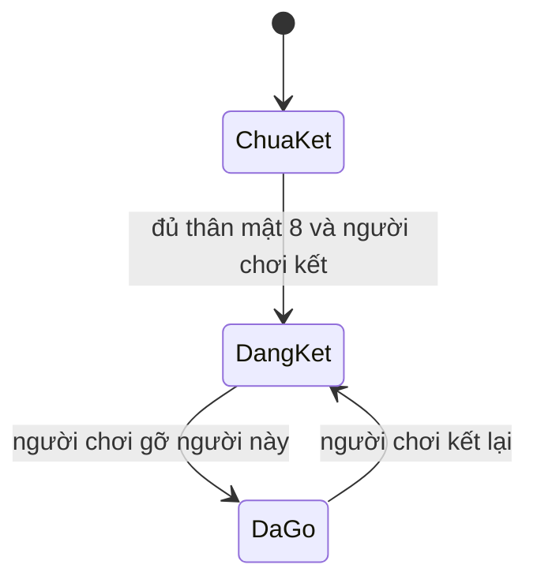

# phase-10-partner-craft — Nhiều đạo lữ và mẻ thứ hai

Milestone from ROADMAP.md; rules from PRODUCT.md.
Outcome: Người chơi kết mọi đạo lữ đã đủ thân, thấy bonus cộng dồn, và luyện
mẻ 6 thảo ra 2 đan. Gỡ một người thì chỉ mất bonus của người đó.

## Open decisions
- **Settled 2026-09-23 (walk) — ai thành đạo lữ:** không giới hạn số người.
  Ba NPC hiện có cùng Diệp Thanh Trúc, Hồng Liên, Bạch Nguyệt, Lôi Tử Yên và
  Vân Nhược Ly, ai đạt thân mật 8 cũng kết được. Cả tám có thể đang kết cùng lúc.
- **Settled 2026-09-23 (walk) — bonus đạo lữ:** mỗi người đang kết cộng cả
  chiến lực lẫn tốc độ tu vi. Các người đang kết cộng dồn. Gỡ một người thì
  bỏ đúng phần người đó. Không đụng đột phá.
- **Settled 2026-09-23 (walk) — công thức thứ hai:** 6 Vân Linh Thảo ra 2
  Tụ Khí Đan, key `recipe/qi_pill_batch`. Công thức 3 ra 1 vẫn còn.

## The flow
1. Save mới hoặc cũ mở Thiên Hạ và thấy đủ tám NPC; năm nữ NPC mới có chân
   dung riêng. Người chơi chọn lời đáp ấm với một NPC để thân mật đạt ít nhất 8.
2. Người chơi mở Đạo Lữ, thấy ai đã đủ 8 và nút kết. Kết một người. Chiến lực
   tăng đúng khoản của một người. Tốc độ tu vi nhân hệ số người đó rồi cộng
   lượng của người đó, trên công thức linh thú hiện có.
3. Người chơi kết thêm người khác đã đủ 8. Bonus cộng thêm đúng một suất nữa.
   Hai tab kết cùng một người vẫn một đạo lữ.
4. Người chơi gỡ một người. Chỉ mất suất của người đó. Người còn lại giữ bonus.
5. Người chơi mở Luyện Đan, thấy mẻ 3 ra 1 và mẻ 6 ra 2. Đủ 6 thảo thì luyện
   mẻ 6: trừ 6, cộng 2, một biên nhận. Cùng mã không luyện lần hai.
6. Reload, restart hoặc redeploy: danh sách đạo lữ, bonus và túi khớp lần ghi.

## Entities
- **Đạo lữ:** một save, một NPC, đang kết hay đã gỡ. Identity: save + NPC.
  Tám key gồm ba key cũ và `ye_qingzhu`, `hong_lian`, `bai_yue`, `lei_ziyan`,
  `yun_ruoli`.
- **Chân dung NPC:** mỗi NPC mới có một asset riêng; thiếu file mới dùng fallback.
- **Suất bonus:** mỗi người đang kết có khoản chiến lực, hệ số tu vi và lượng
  mỗi phút. Bản khởi đầu mỗi người: +3 chiến lực, ×1.05, +0.1 tu vi mỗi phút.
- **Công thức:** `recipe/qi_pill` là 3 ra 1. `recipe/qi_pill_batch` là 6 ra 2.
- **Biên nhận luyện:** một mã yêu cầu cho một save, trỏ đúng một công thức.

## States

- Mỗi NPC một trạng thái. PostgreSQL giữ từng đạo lữ và từng biên nhận.
- Tốc độ = gốc × linh căn × hệ số linh thú × hệ số của mọi đạo lữ đang kết
  + lượng linh thú + tổng lượng các đạo lữ đang kết. Không có đạo lữ thì hệ số
  đạo lữ bằng 1 và lượng đạo lữ bằng 0.
- Chiến lực cộng thêm tổng khoản của những người đang kết.

## Saved for real
- Từng đạo lữ sống qua reload, restart và redeploy. Save cũ không tự kết.
- Gỡ một người không gỡ người khác và không rút tu vi đã chốt.
- Biên nhận mẻ 6 không viết lại biên nhận mẻ 3.
- Đổi cấu hình không viết lại đạo lữ hay biên nhận đã ghi. Số đang hiện dùng
  cấu hình hiện tại.

## Resilience
| Case | Decided behaviour |
|---|---|
| Kết khi thân mật dưới 8 | Từ chối; người đó không thành đạo lữ. |
| Kết lại người đang kết | Vẫn một dòng; bonus không nhân đôi. |
| Gỡ người chưa kết | Từ chối. |
| Hai tab kết cùng một người | Một đạo lữ. |
| Kết người thứ hai | Cộng thêm đúng một suất. Người đầu vẫn còn. |
| Gỡ một người | Mất đúng suất đó. Người kia giữ nguyên. |
| Save đã có thế giới ba NPC | Khi mở lại, năm NPC mới được thêm đúng một lần; NPC, quan hệ và đạo lữ cũ giữ nguyên. |
| Tạo hoặc mở thế giới nhiều lần | Mỗi NPC mới chỉ có một bản ghi. |
| Luyện mẻ 6 khi thảo ít hơn 6 | Từ chối; túi không đổi. |
| Cùng mã mẻ 6 | Trừ 6 và cộng 2 đúng một lần. |
| Mẻ 3 và mẻ 6 | Hai biên nhận khác nhau. |

## Deferred
- Quà, quest, thú chiến đấu và đạo lữ ngoài tám NPC hiện có → chưa có milestone sau phase-10.
- Mua bán với NPC, luyện hỏng và luyện theo giờ → vẫn chưa có milestone.

## Evidence
Automated:
- [x] E-1: Dưới 8 thì không kết. Đủ 8 thì kết được từng người trong tám NPC.
- [x] E-2: Một người đang kết thì chiến lực cộng đúng một suất và tốc độ gồm đúng một hệ số, một lượng.
- [x] E-3: Hai người đang kết thì cộng hai suất. Gỡ một người thì còn đúng một suất.
- [x] E-4: Không có đạo lữ thì tốc độ trở về công thức linh thú. Đột phá không đổi.
- [x] E-5: Đọc được mẻ 6 ra 2. Đủ thảo thì trừ 6 cộng 2 một lần.
- [x] E-6: Cùng mã mẻ 6 không luyện lần hai. Thiếu thảo thì túi không đổi. Mẻ 3 vẫn chạy.
- [x] E-7: Reload và redeploy giữ đạo lữ và túi. Migration không tự kết, không tự luyện.
- [x] E-8: Regression, migration, lint, typecheck và build đều qua.
- [x] E-12: Save mới và cũ đều có đúng tám NPC; mở lại không nhân đôi năm NPC mới.

Manual, at close:
- [x] E-9: Kết một người, thấy tên và cả dòng chiến lực lẫn tốc độ. Kết thêm người thứ hai, bonus tăng.
- [x] E-10: Gỡ một người, reload: chỉ mất suất người đó.
- [x] E-11: Luyện mẻ 6. Desktop, mobile, 320px và bàn phím đọc được đạo lữ, giá và kết quả.
- [x] E-13: Thiên Hạ hiển thị năm chân dung nữ riêng biệt trên desktop và mobile, không ảnh nào rơi về fallback.

## Clarifications
- 2026-09-23 round 1 — asked: ai thành đạo lữ, bonus, công thức thứ hai —
  answered: bao nhiêu đạo lữ cũng được; cả chiến lực và tốc độ tu vi; 6 thảo
  ra 2 đan — raised: cộng dồn theo từng người, ngưỡng thân mật 8 giữ nguyên.
- 2026-09-23 round 2 — asked: số nữ NPC mới và asset — answered: thêm năm
  người, mỗi người có chân dung AI riêng và đều có thể kết duyên — raised:
  save cũ phải nhận roster mới đúng một lần.

## Closed
Hoàn tất 2026-09-24. Backend 137 test và Playwright 37 test pass; lint,
typecheck và production build pass. Kiểm tay trên app thật với schema
PostgreSQL tạm: Thiên Hạ hiện đủ tám NPC, tám chân dung đều tải ảnh riêng
(1024px, không fallback). Diệp Thanh Trúc đạt 8 thiện cảm qua lời đáp ấm;
kết Diệp Thanh Trúc rồi Hồng Liên: +3 → +6 chiến lực, tốc độ 1,49 → 1,665 →
1,843. Gỡ Diệp Thanh Trúc, reload: còn một suất (+3, 1,665). Mẻ 6 thảo: thảo
6 → 0, đan 3 → 5. 1440px, 390px và 320px không tràn ngang. Ghi chú ngoài
scope: font Georgia của tiêu đề vẽ sai chữ "ầ" (Tạ Vô Trầ`n), có từ trước
phase-10, chưa sửa. Review: Ready.
