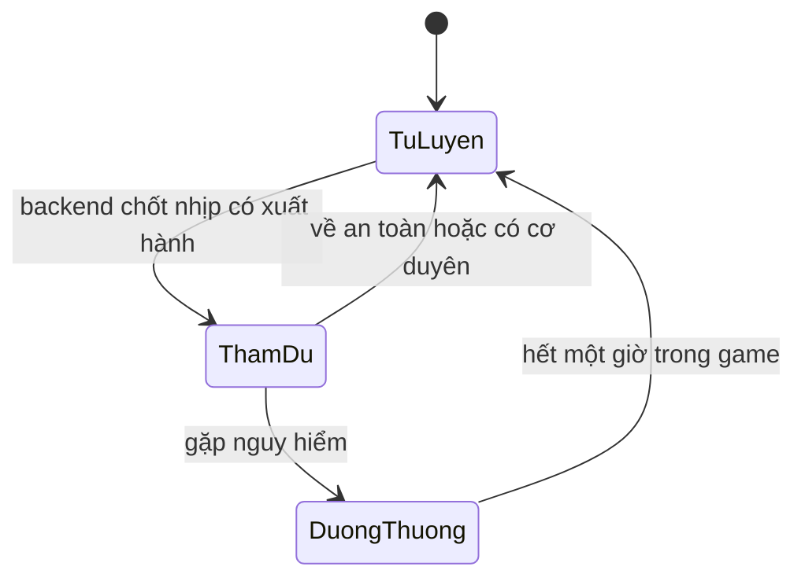

# phase-4-living-world — Thiên Hạ vẫn vận hành

Milestone from ROADMAP.md; rules from PRODUCT.md.
Outcome: Người chơi trở lại sau offline thấy NPC đổi trạng thái, tiến bộ tu vi
và có tin tức thế giới đã lưu, với diễn biến nhất quán qua mọi lần đồng bộ.
Status: Đã phê duyệt triển khai 2026-09-18. Các thông số chưa được owner chọn
riêng dùng đúng mặc định đã ghi trong scope.

## Open decisions
- **Settled 2026-09-18 (owner) — dàn nhân vật:** Tạ Vô Trần, Lạc Thanh Hàn và một tán tu;
  hai nhân vật có tên được ưu tiên nội dung. Dùng ảnh dự phòng trước; chưa
  yêu cầu tạo chân dung mới hoặc xác lập tuyến đạo lữ.
- **Settled 2026-09-18 (owner) — thời gian:** mỗi nhịp 10 phút, bù tối đa 24 giờ/lần quay lại;
  khoảng thời gian vượt giới hạn được bỏ qua có thông báo, không tích thành nợ.
- **Settled 2026-09-18 (owner) — tác động:** chỉ thay đổi NPC và tin tức; không phát loot,
  buff/debuff cho player. Sự kiện thế giới chưa mở địa điểm hoặc nhiệm vụ mới.

## The flow
1. Người chơi mở game hoặc đồng bộ: backend tính diễn biến thế giới từ mốc đã
   lưu. Giao diện hiển thị giờ thế giới cập nhật, không giả lập bằng đồng hồ máy.
2. Mở **Thiên Hạ**: thấy danh sách NPC, cảnh giới/tầng, hoạt động, địa điểm và
   bảng tin mới nhất; save mới có trạng thái khởi đầu cùng lời giới thiệu.
3. Chọn NPC: xem hồ sơ, thanh tu vi, hoạt động, thương tích và các sự kiện riêng
   theo thời gian. Hồ sơ là trạng thái đã lưu, không có nút nhận thưởng/giao dịch.
4. Sau một khoảng vắng mặt có diễn biến, thấy thẻ **Trong lúc bạn vắng mặt**:
   số NPC tiến bộ, đột phá, cơ duyên và sự kiện đáng chú ý; chọn xem Thiên Hạ
   hoặc đánh dấu đã đọc. Chưa có diễn biến thì không hiện thẻ rỗng.
5. Reload, mở tab mới hoặc khởi động lại: hồ sơ, sự kiện và báo cáo chưa đọc còn
   nguyên. Người chơi tiếp tục tu luyện/thám hiểm với quy tắc Phase 1–3.

## Entities
- Dàn NPC khởi đầu đã chốt: Tạ Vô Trần, Lạc Thanh Hàn và một tán tu;
  dùng chân dung dự phòng trong bản đầu.
- **World state:** mỗi save một thế giới; mốc khởi tạo UTC, nhịp cuối đã xử lý,
  seed cố định, phiên bản luật. Identity: save; tạo lần đầu không mô phỏng quá khứ.
- **NPC:** key cố định trong save; tên, mô tả, căn cơ, cảnh giới/tầng, tu vi,
  hoạt động, địa điểm, thời điểm hết thương tích, portrait key tùy chọn.
  Identity: save + NPC key, không dùng tên hiển thị để chống trùng.
- **World event:** loại, thời điểm trong game, NPC liên quan nếu có, nội dung,
  thay đổi trạng thái tương ứng. Identity: save + nhịp + nguồn + thứ tự sự kiện.
  Nguồn là NPC key hoặc thế giới; tin đã lưu không bốc lại khi đổi bộ lọc.
- **Return report:** khoảng thời gian, danh sách event, tổng hợp, phần vượt cap,
  trạng thái chưa đọc/đã đọc. Identity riêng trong save; không chứa phần thưởng.

## States

- Backend là actor duy nhất chuyển trạng thái NPC. Dưỡng thương ngừng tu luyện
  và thám du; không có chết, mất đồ hoặc giảm cảnh giới trong đợt này.
- NPC tu luyện dùng yêu cầu tu vi/cảnh giới hiện có, tốc độ theo cấu hình riêng;
  mỗi nhịp hoàn thành chỉ xét tối đa một lần đột phá, thành công mới đổi tầng.
  Tỷ lệ cơ bản dùng dữ liệu cảnh giới; không dùng đan của player. Thất bại mất
  10% tu vi yêu cầu, tối đa bằng tu vi đang có; đạt trần thì không đột phá tiếp.
- Thứ tự một nhịp: hết thương tích → hoạt động hiện tại → tu vi/đột phá →
  chọn hoạt động nhịp kế tiếp → tin thế giới. Tiêu hao phần thời gian chỉ một lần.
- Return report: chưa đọc → đã đọc bởi player; nhấn lại không thay đổi thế giới.
  Một báo cáo chưa đọc được nối thêm các nhịp mới; không tạo modal chồng lớp.
- Source of truth: PostgreSQL giữ trạng thái NPC, mốc mô phỏng, event và report;
  frontend chỉ đọc. Bản tổng hợp và bộ lọc không phải nguồn trạng thái độc lập.

## Simulation and content
- Chốt nhịp theo mốc khởi tạo của save; chưa đủ 10 phút thì giữ phần dư.
  Mở mỗi phút hay một lần sau hai giờ phải cho cùng 12 nhịp và kết quả.
- RNG có seed theo save/nhịp/nguồn, qua random service; không phụ thuộc số HTTP
  request hoặc RNG của player. Engine thuần nhận snapshot, thời gian đích và RNG.
- Đề xuất khi đang tu luyện: 80% tiếp tục, 20% xuất hành ở nhịp sau. Thám du
  kết thúc sau một nhịp: 60% an toàn, 25% cơ duyên, 15% thương nhẹ.
- Cơ duyên cộng tu vi bằng 10% yêu cầu tầng hiện tại; không rơi vật phẩm trong
  slice này. NPC không chiến đấu bằng engine của player ở đợt đầu.
- Mỗi nhịp có 5% xuất hiện tin thế giới, chọn từ tập nội dung: linh khí hội tụ,
  thương đội ghé qua, khí tức yêu thú. Đây là tin tức, không có nút nhận thưởng.
- Ghi đột phá, cơ duyên, bị thương, hồi phục và tin thế giới; không ghi từng
  nhịp cộng tu vi. Tin có thời điểm xảy ra, khác thời điểm người chơi đọc.
- Tối đa 144 nhịp được bù/lần; khi vượt cap, xử lý 144 nhịp đầu còn thiếu,
  bỏ các nhịp trọn vẹn còn lại, giữ phần dư. Hiển thị rõ thời gian không mô phỏng.
- Khi nâng phiên bản luật, giữ lịch sử và seed; migration chốt mốc chuyển luật.
  Không diễn giải lại event cũ hoặc âm thầm dùng luật mới cho cùng một receipt.

## Interface
- Thiên Hạ mở từ navigation hiện có: thẻ tổng quan → NPC → tin tức; mobile xếp
  một cột. Bộ lọc **Tất cả / NPC / Thế giới** chỉ lọc dữ liệu đã lưu.
- Hồ sơ NPC mở từ danh sách, có nút quay lại; dùng bàn phím được, focus rõ ràng.
  Thiếu portrait dùng fallback local có tên NPC; không cần ảnh AI để chứng minh luồng.
- Tin mới nhất trước, tải thêm lịch sử theo thứ tự thời gian ổn định; snapshot NPC
  luôn mang thời điểm cập nhật để người chơi hiểu dữ liệu khi mất mạng.
- Báo cáo thế giới nằm cạnh báo cáo tu luyện, không tự đóng báo cáo chưa đọc khác.

## Saved for real
- Save cũ/mới nhận đúng một thế giới và dàn NPC; chỉ bắt đầu từ lần khởi tạo.
  Không tự tạo sự kiện cho thời gian trước khi tính năng tồn tại.
- NPC, event, report và mốc thời gian commit cùng nhau; lỗi thì rollback tất cả.
- Sống qua reload, clear storage, đóng/mở browser, restart backend và redeploy.
  Không có worker nền; đọc state hoặc thao tác trong game kích hoạt cập nhật.

## Resilience
| Case | Decided behaviour |
|---|---|
| Hai tab/nhấn đồng bộ hai lần | Cùng khoảng thời gian chỉ xử lý một lần; không trùng event/tu vi. |
| Mất reply sau commit | Đọc lại snapshot/report đã lưu; không bốc lại RNG. |
| Lỗi giữa nhịp hoặc trước commit | Không nhảy mốc; retry tái hiện cùng kết quả. |
| Browser đổi giờ/server lùi giờ | Dùng UTC server; elapsed âm bằng 0, mốc không lùi. |
| Offline vượt 24 giờ | Áp cap một lần; sync tiếp không xử lý lại phần đã bỏ. |
| Chưa đủ một nhịp | Không event mới; phần dư giữ cho lần sau. |
| Migration chạy lại | Không reset NPC, seed, lịch sử hoặc báo cáo đã đọc. |
| Đánh dấu report hai lần | Một trạng thái đã đọc; tin lịch sử không bị xóa. |
| Mất mạng khi mở Thiên Hạ | Giữ snapshot cũ kèm thông báo; đồng bộ lại để xem diễn biến. |

## Deferred
- Trong phase-4-living-world, chưa thuộc slice đầu: NPC gặp player, hội thoại,
  quan hệ/đạo lữ, chết/vĩnh viễn, kinh tế NPC, chân dung riêng và quest thế giới.
  Phải bổ sung scope và evidence trước khi xây; không tự tính là đã hoàn tất.
- Nhiều bản đồ, loot trang bị và auto-thám hiểm player từ Phase 3: tiếp tục để
  phần mở rộng phase-4-living-world, cần scope riêng trước khi đưa vào.
- Multiplayer/PvP, WebSocket, worker, Redis/Celery → Dropped trong ROADMAP.md.

## Evidence
Automated:
- [x] E-1: Save cũ/mới/migration lặp → đúng một thế giới, không sự kiện quá khứ.
- [x] E-2: Cùng seed/snapshot/thời gian → cùng NPC/event; engine không cần HTTP.
- [x] E-3: Nhiều lần sync nhỏ và một lần sync lớn trong cap → cùng kết quả/phần dư.
- [x] E-4: Ép RNG từng nhánh → đột phá, thất bại, cơ duyên, thương và hồi phục đúng.
- [x] E-5: Đồng bộ đồng thời/retry mất reply → một lần tiến bộ, không event trùng.
- [x] E-6: Inject lỗi trước commit → rollback NPC/event/report/mốc, retry tái hiện.
- [x] E-7: Biên 0/9/10 phút, giờ lùi, 24 giờ và vượt cap → đúng số nhịp/phần dư.
- [x] E-8: Đóng kết nối/restart/redeploy → đọc đúng snapshot, report và lịch sử.
- [x] E-9: Đọc report lặp/lọc/phân trang → không mất hoặc trùng tin, không thêm loot.
- [x] E-10: Regression Phase 1–3, migration, lint/typecheck/build đều qua.
Manual, at close:
- [x] E-11: Dùng fixture tiến thời gian → Thiên Hạ/hồ sơ/tin/báo cáo nhất quán.
- [x] E-12: Desktop/mobile/320px, keyboard, portrait lỗi → đọc và điều hướng được.
- [x] E-13: Clear storage/reopen và mất mạng rồi sync → trạng thái/report vẫn đúng.

## Clarifications
- 2026-09-18: Owner chọn hai NPC có tên và một tán tu; đã cập nhật dàn nhân vật.
  Owner chọn nhịp 10 phút, bù tối đa 24 giờ và chỉ thay đổi NPC/tin tức.
  Đã cập nhật luồng mô phỏng và các mốc kiểm thử; tối đa vẫn là 144 nhịp.

## Closed
Hoàn tất 2026-09-21. Backend 62 test và frontend 26 Playwright test pass;
lint, typecheck, production build và migration 0007 pass. Agent-browser kiểm tra
Thiên Hạ, hồ sơ NPC, báo cáo offline, fallback portrait và layout 320px; console
và browser errors trống. Rollback, concurrent sync, clear storage, mất mạng,
giới hạn 24 giờ và không đổi tài nguyên player đều có test.
