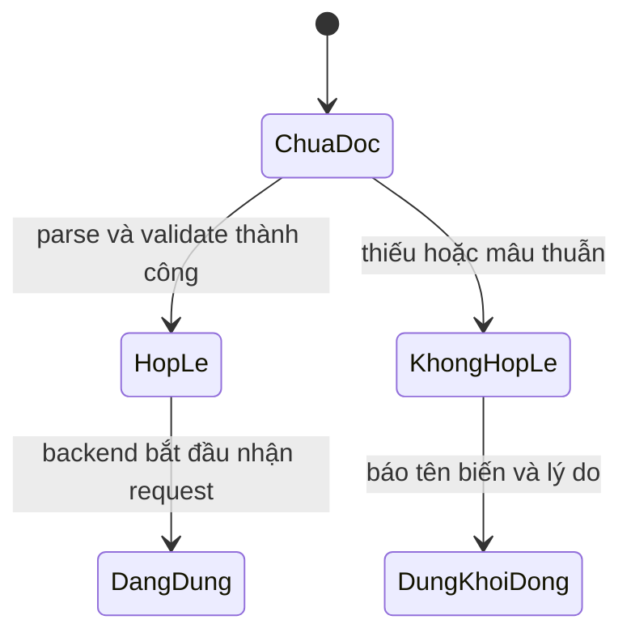

# phase-5-game-configuration — Cân bằng từ environment

Milestone from ROADMAP.md; rules from PRODUCT.md.
Outcome: Operator thay đổi mọi tham số cân bằng gameplay qua environment và
restart ứng dụng để luật mới được áp dụng có kiểm tra.

## Open decisions
- **Settled 2026-09-21 (walk) — save hiện có:** tham số mới chỉ áp dụng cho
  phép tính và hành động phát sinh sau restart; state và receipt đã commit
  không bị tính lại.
- **Settled 2026-09-21 (walk) — cấu hình sai:** thiếu biến bắt buộc, xác suất
  ngoài 0–1, số âm không hợp lệ hoặc quan hệ ngưỡng mâu thuẫn làm backend dừng
  startup với lỗi chỉ rõ tên biến.

## The flow
1. Operator sao chép `.env.example` thành `.env`; file mẫu chứa mọi tham số
   gameplay, giá trị mặc định hiện tại, nhóm rõ ràng và không chứa secret thật.
2. Backend khởi động, parse toàn bộ cấu hình thành một game-rules object có kiểu,
   kiểm tra từng giá trị và quan hệ giữa các giá trị trước khi nhận request.
3. Engine, service, seed/migration và fixture đọc cùng game-rules object; không
   giữ bản sao số cân bằng trong nhánh xử lý riêng.
4. Operator sửa `.env`, tăng `GAME_RULES_VERSION` và restart. Hành động mới dùng
   luật mới; API/report/receipt liên quan ghi phiên bản luật đã dùng.
5. Nếu cấu hình sai, backend không khởi động và không kết nối để thay đổi save.

## Entities
- **Game rules:** phiên bản và các nhóm cultivation, breakthrough, starting
  resources, realm/root curves, equipment, exploration/battle, living world,
  NPC seed stats và relationship defaults. Identity: rules version + fingerprint.
- **Rule snapshot reference:** rules version/fingerprint gắn vào receipt hoặc
  world report cần giải thích kết quả; dữ liệu kết quả đã commit vẫn bất biến.
- **Environment template:** danh sách biến có giá trị phát triển an toàn và mô
  tả đơn vị/range; `.env` là bản local không commit.

Không phải gameplay parameter: database URL, CORS, display text, stable content
keys và asset paths. Chúng vẫn có cấu hình hoặc content source phù hợp riêng.

## Configuration inventory
| Group | Environment source | Runtime consumers |
|---|---|---|
| Identity | `GAME_RULES_VERSION` + computed fingerprint | startup registry, health, receipts/reports |
| Starting save | `GAME_STARTING_*`, `GAME_EQUIPMENT_PACK_QUANTITY` | new game, inventory/equipment repositories |
| Cultivation | `GAME_CULTIVATION_*`, `GAME_REALM_RULES`, `GAME_ROOT_RULES` | cultivation, realm sync, breakthrough preview |
| Breakthrough | `GAME_BREAKTHROUGH_*`, `GAME_OFFLINE_REPORT_MIN_SECONDS` | preview, commit, offline report |
| Exploration/battle | `GAME_EXPLORATION_*`, `GAME_BATTLE_*` | exploration receipt, battle engine, rewards |
| Living world | `GAME_WORLD_*`, `GAME_NPC_RULES` | world engine, NPC seed, return report |
| Relationships | `GAME_RELATIONSHIP_*` | Phase 6 cooldown and affinity boundaries |

Audit loại khỏi balance tuning các hằng cấu trúc: 60 giây/phút, tăng một stage,
biên xác suất 0–1, luật sản phẩm dùng 0/1 đan, pagination, HTTP status, stable
keys, copy và asset paths. Mọi số còn lại ảnh hưởng kết quả gameplay nằm trong
inventory trên, template và test override tương ứng.

## States

- Environment được đọc một lần khi process khởi động; không live reload.
- Game-rules object là nguồn tham số runtime. PostgreSQL vẫn là nguồn state,
  ownership và receipt; thay config không viết lại state lịch sử.

## Saved for real
- `.env.example` được commit; `.env` local bị ignore. Deploy cung cấp cùng biến
  qua environment mà không cần file vật lý.
- Receipt và report đã commit giữ kết quả cùng rules version/fingerprint qua
  reload, restart và redeploy; đổi config không diễn giải lại lịch sử.

## Resilience
| Case | Decided behaviour |
|---|---|
| Thiếu hoặc sai kiểu | Startup thất bại, nêu đúng biến; không dùng fallback âm thầm. |
| Xác suất ngoài 0–1 | Startup thất bại trước khi engine chạy. |
| Ngưỡng/cap mâu thuẫn | Validation chéo thất bại và nêu nhóm cấu hình. |
| Đổi `.env` khi app đang chạy | Không đổi process hiện tại; restart mới áp dụng. |
| Đổi luật với save cũ | Chỉ hành động mới dùng luật mới; state/receipt cũ giữ nguyên. |
| Quên tăng rules version | Fingerprint lệch version làm startup thất bại. |
| Rollback deploy | Chỉ cặp version/fingerprint đã đăng ký được dùng lại; receipt cũ giữ nguyên. |
| Hai instance khác luật | Health/config metadata lộ version/fingerprint để deploy phát hiện. |
| Migration và runtime khác config | Cùng settings factory được inject vào cả hai; test kiểm chứng parity. |
| Test cần luật đặc biệt | Tạo settings override riêng, không sửa process environment toàn cục. |

## Deferred
- Live reload và trang admin chỉnh cân bằng → milestone vận hành chỉ thêm khi
  deploy thực tế cần; Phase 5 dùng restart rõ ràng.
- Hội thoại và thiện cảm dùng cooldown mặc định 12 giờ →
  `phase-6-npc-relationships`.
- Hành trình, linh thú và luyện đan → lần lượt `phase-7-world-journeys`,
  `phase-8-spirit-pets`, `phase-9-alchemy`.

## Evidence
Automated:
- [x] E-1: Audit engine/service/data → không còn gameplay tuning literal ngoài settings/default template.
- [x] E-2: `.env.example` parse đủ và tạo fingerprint ổn định; override từng nhóm đổi đúng calculation.
- [x] E-3: Thiếu/sai kiểu/out-of-range/mâu thuẫn/version không tăng → startup fail với tên biến.
- [x] E-4: Cultivation, breakthrough, starting resources, realm/root curves và equipment đọc config.
- [x] E-5: Exploration, battle, rewards, world timing/outcomes và NPC seed stats đọc config.
- [x] E-6: Migration, runtime và test fixture dùng cùng rules object; save cũ không bị reset.
- [x] E-7: Receipt/report mới ghi version/fingerprint; dữ liệu cũ giữ nguyên sau đổi config.
- [x] E-8: Config khác chỉ tác động hành động mới; retry receipt cũ trả kết quả cũ.
- [x] E-9: Full backend regression, migration, frontend Playwright, lint/typecheck/build đều qua.

Manual, at close:
- [x] E-10: Copy mẫu → startup; đổi một biến mỗi nhóm + restart → UI/API hiện kết quả mới.
- [x] E-11: Cấu hình sai → backend từ chối khởi động với lỗi dễ sửa, save không đổi.
- [x] E-12: Restart bằng luật mới → lịch sử cũ giữ nguyên, hành động mới hiện rules version mới.

## Clarifications
- 2026-09-21: Owner chốt thay đổi environment chỉ áp dụng về sau; flow,
  source-of-truth, resilience và evidence đã phản ánh quyết định này.
- 2026-09-21: Owner chốt fail fast cho biến thiếu, sai kiểu/range và quan hệ
  mâu thuẫn; không dùng fallback âm thầm khi operator đã cung cấp cấu hình lỗi.

## Closed
2026-09-21 — Typed rules, startup registry, historical receipt/report identity,
operator workflow and every E-1..E-12 check passed. Final review: Ready.
