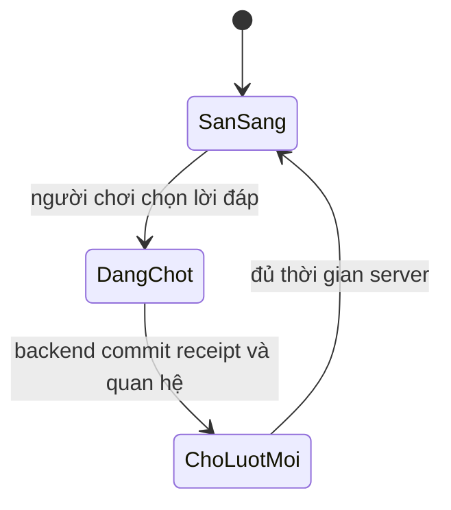

# phase-6-npc-relationships — Gặp gỡ người trong thiên hạ

Milestone from ROADMAP.md; rules from PRODUCT.md.
Outcome: Người chơi gặp một NPC đang sống trong thế giới, chọn cách đáp lại và
trở về sau đó vẫn thấy quan hệ cùng lịch sử hội thoại đã lưu.

## Open decisions
- **Settled 2026-09-21 (walk) — hình thức tương tác:** mỗi lượt dùng một tình
  huống ngắn với ba lựa chọn lời đáp; lựa chọn đổi thiện cảm và nội dung kết quả.
- **Settled 2026-09-21 (walk) — nhịp gặp gỡ:** mỗi NPC có tối đa một lượt trò
  chuyện mới theo cooldown environment, mặc định 12 giờ UTC server; lượt chưa
  dùng không cộng dồn.
- **Settled 2026-09-21 (walk) — tác động:** thiện cảm chỉ đổi hội thoại, cách
  xưng hô và tin NPC; chưa cấp quà, buff, quest hoặc mở đạo lữ.

## The flow
1. Người chơi mở **Thiên Hạ**, chọn NPC và thấy thiện cảm, lần trò chuyện gần
   nhất, trạng thái có thể trò chuyện và các dấu chân Phase 4.
2. Khi có lượt, người chơi chọn **Trò chuyện**; backend đưa ra một tình huống
   phù hợp NPC và đúng phiên bản nội dung đã lưu.
3. Người chơi chọn một trong ba lời đáp. Backend chốt đúng một kết quả, thay đổi
   thiện cảm trong giới hạn và lưu cả lựa chọn lẫn lời hồi đáp.
4. Hồ sơ hiện thiện cảm mới, kết quả vừa nhận, lịch sử gần nhất và thời điểm có
   thể trò chuyện tiếp. Reload hoặc mất reply đọc lại cùng kết quả.
5. Khi chưa tới lượt mới, người chơi vẫn đọc hồ sơ/lịch sử nhưng không thể tạo
   thêm tương tác. Mô phỏng Phase 4 và tài nguyên player tiếp tục độc lập.

## Entities
- **NPC relationship:** player, NPC key, affinity, last interaction time,
  next available time. Identity: save + NPC key; tạo khi đọc/tương tác lần đầu.
- **Interaction prompt:** stable content key, NPC key, version, situation text,
  three response choices and their bounded affinity deltas.
- **Interaction receipt:** request id, relationship, prompt key/version, chosen
  response, resulting affinity, response text and server time. Identity:
  save + request id; dữ liệu đã chốt không đổi khi nội dung mới được phát hành.

## States

- PostgreSQL là nguồn sự thật cho quan hệ, cooldown và receipt. Frontend chỉ
  giữ request id đang chờ để phục hồi mất reply; browser time không mở lượt.
- Affinity dùng thang 0–100, khởi đầu 0 và được chặn tại hai đầu. Bản đầu không
  giảm affinity theo thời gian và không cho quan hệ âm.

## Saved for real
- Quan hệ và receipt sống qua reload, clear storage, đóng/mở browser, restart
  backend và redeploy. Save cũ tạo quan hệ không phát sinh hội thoại quá khứ.
- Chọn lời đáp, đổi affinity và tạo receipt commit cùng transaction. Nội dung
  cũ đọc từ receipt, không dựng lại từ bảng nội dung hiện tại.

## Resilience
| Case | Decided behaviour |
|---|---|
| Nhấn lựa chọn hai lần | Cùng request id trả một receipt; affinity chỉ đổi một lần. |
| Mất reply sau commit | Frontend giữ request id, đọc lại receipt và không chọn lại. |
| Request id cũ với lựa chọn khác | Backend từ chối xung đột; receipt đầu giữ nguyên. |
| Hai tab chọn đồng thời | Chỉ một tương tác thắng cho cùng lượt; tab còn lại đọc kết quả đã lưu. |
| Lỗi trước commit | Không receipt, không đổi affinity/cooldown; retry an toàn. |
| Đồng hồ browser sai | Cooldown dùng UTC server và mốc đã lưu. |
| NPC đang dưỡng thương/thám du | Vẫn trò chuyện trong slice này; trạng thái chỉ đổi lời dẫn, không chặn lượt. |
| Nội dung được cập nhật | Receipt cũ giữ prompt/version/text cũ; lượt mới dùng phiên bản mới. |
| Save cũ/redeploy | Tạo quan hệ khi cần, không reset affinity hoặc lịch sử hiện có. |

## Deferred
- Quà tặng, thưởng/buff, quest, NPC chiến đấu, romance và đạo lữ → một milestone
  quan hệ mở rộng chỉ được thêm sau khi Phase 5 chứng minh vòng hội thoại.
- Nhiều địa điểm, hành trình theo thời gian, loot trang bị/vật liệu →
  `phase-7-world-journeys`.
- Thu phục/kích hoạt linh thú → `phase-8-spirit-pets`.
- Công thức và luyện đan → `phase-9-alchemy`.
- NPC chết vĩnh viễn, multiplayer và PvP → Dropped trong ROADMAP.md.

## Evidence
Automated:
- [ ] E-1: Save cũ/mới đọc NPC → đúng một relationship/NPC, affinity ban đầu 0.
- [ ] E-2: Cùng prompt và lựa chọn → receipt/result ổn định; affinity bị chặn 0–100.
- [ ] E-3: Submit/retry/concurrent hai tab → một receipt và một lần đổi affinity.
- [ ] E-4: Mất reply rồi phục hồi request id → đọc đúng receipt, không áp lại delta.
- [ ] E-5: Inject lỗi giữa transaction → relationship/receipt/cooldown cùng rollback.
- [ ] E-6: Biên cooldown, giờ lùi và browser đổi giờ → server mở đúng một lượt.
- [ ] E-7: Đổi phiên bản nội dung → receipt cũ giữ nguyên, lượt mới dùng bản mới.
- [ ] E-8: Migration/restart/redeploy → affinity, cooldown và lịch sử còn nguyên.
- [ ] E-9: Tương tác không đổi tu vi, vật phẩm, trang bị, chiến lực hoặc thế giới NPC.
- [ ] E-10: Regression Phase 1–4, migration, lint, typecheck và build đều qua.

Manual, at close:
- [ ] E-11: Chọn NPC → trò chuyện → chọn lời đáp → thấy thiện cảm và lịch sử đổi.
- [ ] E-12: Reload/clear storage/mất mạng rồi retry → cùng kết quả, không tăng hai lần.
- [ ] E-13: Desktop/mobile/320px và bàn phím → prompt, lựa chọn, cooldown đọc được.

## Clarifications
- 2026-09-21: Owner chốt hình thức tương tác ba lựa chọn; flow, entities,
  resilience và evidence hiện tại đã phản ánh lựa chọn này, không phát sinh điểm mới.
- 2026-09-21: Owner đổi nhịp mặc định thành 12 giờ và yêu cầu cấu hình qua
  environment; relationship chuyển sang Phase 6 sau nền cấu hình Phase 5.
- 2026-09-21: Owner chốt thiện cảm chỉ tác động nội dung; flow, resilience,
  deferred và evidence giữ nguyên, không phát sinh điểm mở mới.

## Closed
