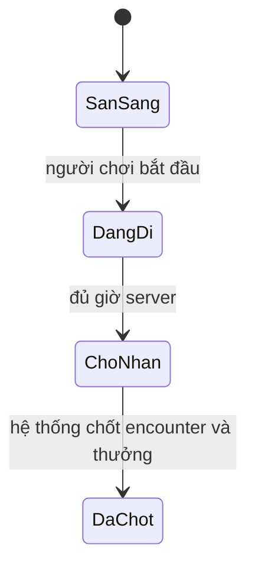

# phase-7-world-journeys — Hành trình nhiều nơi

Milestone from ROADMAP.md; rules from PRODUCT.md.
Outcome: Người chơi chọn một trong vài địa điểm, hoàn thành hành trình có thời
gian và nhận trang bị hoặc nguyên liệu riêng của nơi đó.

## Open decisions
- **Owner — lượt tức thì:** Thanh Vân Sơn vẫn xong ngay như hiện tại; ba hành
  trình mới chạy theo thời gian bên cạnh. (default: giữ lượt tức thì)
- **Owner — địa điểm:** Hậu Sơn 15 phút, Ngoại Vi 1 giờ, Linh Mạch 4 giờ.
  (default: đúng ba nơi và ba mốc này)
- **Owner — phần thưởng:** mỗi nơi một bảng loot, nhận một lần lúc hoàn thành.
  Hậu Sơn cho nguyên liệu, Ngoại Vi cho trang bị thường, Linh Mạch cho trang bị
  tốt hơn. Chưa có linh thú hay đan đã luyện. (default: đúng bảng này)

## The flow
1. Người chơi mở Thám Hiểm, thấy lượt Thanh Vân Sơn tức thì và ba hành trình
   với thời gian, mức nguy hiểm và gợi ý phần thưởng.
2. Người chơi bắt đầu một hành trình. Hệ thống lưu nơi, lúc bắt đầu, lúc xong
   và một mã yêu cầu. Mỗi save chỉ có một hành trình đang đi.
3. Trong lúc chờ, tu luyện, túi đồ và trò chuyện NPC vẫn dùng được. Giờ máy
   người chơi không làm hành trình xong sớm.
4. Khi giờ server tới lúc xong, lần đọc hoặc lần nhận kết quả chốt đúng một
   encounter của nơi đó và một phần thưởng trong bảng loot.
5. Người chơi thấy kết quả, nhật ký và vật phẩm mới. Mở lại sau reload vẫn
   thấy cùng hành trình và cùng phần thưởng.

## Entities
- **Địa điểm hành trình:** key, tên, thời gian, mức nguy hiểm, bảng encounter
  và bảng loot. Identity: key ổn định.
- **Hành trình:** save, địa điểm, mã yêu cầu, lúc bắt đầu, lúc xong, kết quả
  và phần thưởng đã chốt. Identity: save + mã yêu cầu.
- **Phần thưởng địa điểm:** vật phẩm hoặc nguyên liệu, số lượng có giới hạn,
  gắn với hành trình đã chốt. Identity: thuộc một hành trình.

## States

- PostgreSQL giữ hành trình, mốc giờ và phần thưởng đã chốt. Frontend chỉ hiện
  trạng thái và giữ mã yêu cầu đang chờ để đọc lại kết quả.

## Saved for real
- Hành trình đang đi, kết quả và phần thưởng sống qua reload, đóng browser,
  restart và redeploy. Save cũ không tự có hành trình dở.
- Chốt encounter và nhận thưởng nằm trong một lần ghi. Đọc lại không battle
  lần hai và không phát thưởng lần hai.

## Resilience
| Case | Decided behaviour |
|---|---|
| Bắt đầu hai lần | Cùng mã yêu cầu trả một hành trình; không tạo lượt thứ hai. |
| Mất reply sau khi chốt | Đọc lại đúng kết quả và thưởng đã lưu. |
| Mã cũ với địa điểm khác | Từ chối xung đột; hành trình đầu giữ nguyên. |
| Hai tab cùng nhận | Chỉ một lần chốt thắng; tab kia đọc kết quả đã lưu. |
| Lỗi trước khi chốt | Không thưởng, không kết quả cuối; nhận lại an toàn. |
| Giờ browser sai | Mốc xong dùng UTC server đã lưu. |
| Đang đi rồi redeploy | Giữ lúc bắt đầu và lúc xong; không reset thưởng. |
| Thua encounter | Không nhận thưởng địa điểm; nhật ký và lý do vẫn còn. |
| Lượt Thanh Vân Sơn tức thì | Vẫn xong ngay, không chiếm chỗ hành trình đang đi. |

## Deferred
- Thu phục và kích hoạt linh thú → `phase-8-spirit-pets`.
- Dùng nguyên liệu để luyện đan → `phase-9-alchemy`.
- Nhiều hành trình cùng lúc, bản đồ lớn và chiến đấu realtime → Dropped hoặc
  một milestone sau, chưa mở trong lát này.
- Quà NPC, quest và đạo lữ → milestone quan hệ mở rộng sau.

## Evidence
Automated:
- [ ] E-1: Ba địa điểm đọc được; save cũ không có hành trình dở.
- [ ] E-2: Bắt đầu rồi reload trước giờ xong → vẫn đang đi, chưa có thưởng.
- [ ] E-3: Đủ giờ server → một encounter và một thưởng đúng bảng nơi đó.
- [ ] E-4: Nhận lại, hai tab và mã xung đột → một kết quả, một lần thưởng.
- [ ] E-5: Lỗi trước khi chốt → không thưởng; nhận lại an toàn.
- [ ] E-6: Giờ browser đổi và redeploy → mốc server giữ nguyên.
- [ ] E-7: Thua encounter không thưởng; thắng cộng đúng một lần vào túi.
- [ ] E-8: Lượt Thanh Vân Sơn tức thì vẫn chạy khi không có hành trình đang đi.
- [ ] E-9: Regression, migration, lint, typecheck và build đều qua.

Manual, at close:
- [ ] E-10: Chọn nơi, chờ hoặc mô phỏng đủ giờ, nhận thưởng riêng của nơi đó.
- [ ] E-11: Reload, xóa storage, mất reply → cùng kết quả, không nhân thưởng.
- [ ] E-12: Desktop, mobile, 320px và bàn phím đọc được thời gian và kết quả.

## Closed
