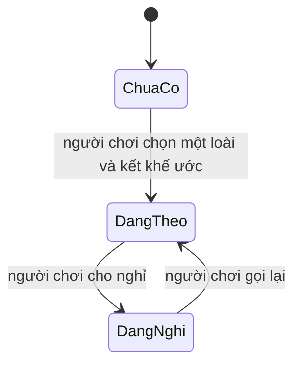

# phase-8-spirit-pets — Một linh thú có bonus

Milestone from ROADMAP.md; rules from PRODUCT.md.
Outcome: Người chơi chọn một trong ba linh thú, giữ và kích hoạt. Bonus chiến
lực và tốc độ tu vi hiện đúng một lần khi đang theo, rồi biến mất khi cho nghỉ.

## Open decisions
- **Settled 2026-09-23 (walk) — linh thú đầu:** ba loài, người chơi chọn một
  cho save. Không thu phục con thứ hai trong lát này.
- **Settled 2026-09-23 (walk) — cách thu phục:** nút kết khế ước trên màn Linh
  Thú, một biên nhận. Động Phủ chỉ hiện con đang theo. Không lấy từ hành trình
  hay gói trang bị.
- **Settled 2026-09-23 (walk) — biên giới bonus:** vừa chiến lực vừa tốc độ tu
  vi. Tỉ lệ đột phá, túi đồ, sáu ô trang bị và quan hệ NPC không đổi.
- **Settled 2026-09-23 (walk) — ba loài:** Thanh Xà nghiêng chiến lực, Hỏa Hồ
  ở giữa, Vân Tước nghiêng tu vi. Mỗi con có khoản chiến lực, hệ số tu vi và
  lượng mỗi phút khác hai con kia. Hệ số khác 1; khoản và lượng khác 0. Số
  cụ thể nằm trong cấu hình.
- **Settled 2026-09-23 (walk) — cách cộng tu vi:** tốc độ = tốc độ gốc × linh
  căn × hệ số loài + lượng mỗi phút của loài. Chưa có thú hoặc đang nghỉ thì
  hệ số bằng 1 và lượng bằng 0. Tu vi đã chốt không bị rút.

## The flow
1. Người chơi mở Linh Thú, thấy ba loài và nút kết khế ước. Chưa có con nào.
   Động Phủ ghi "Chưa kết khế ước". Chiến lực bằng nền cộng trang bị. Tốc độ
   tu vi là tốc độ gốc nhân linh căn.
2. Người chơi chọn một loài và kết khế ước. Hệ thống lưu đúng con đó, đang
   theo, cùng một mã yêu cầu. Hai loài kia không thành khế ước.
3. Người chơi thấy tên con và dòng "Từ linh thú" trên chiến lực. Tốc độ tu vi
   bằng tốc độ gốc nhân linh căn nhân hệ số con đó, rồi cộng lượng mỗi phút
   của con đó. Đột phá không đổi. Con không vào túi đồ và không chiếm sáu ô.
4. Người chơi cho nghỉ. Hệ thống chốt tu vi tới lúc đó với đủ hệ số và lượng
   cũ, rồi khoảng sau chỉ còn tốc độ gốc nhân linh căn. Chiến lực giảm đúng
   khoản của con đó. Tên vẫn còn.
5. Người chơi gọi lại. Chiến lực cộng lại đúng khoản đó. Tu vi từ lúc gọi lại
   dùng lại hệ số và lượng của con đó. Tu vi đã chốt không tính lại.
6. Reload, đóng trình duyệt, restart hoặc redeploy: cùng một con, cùng trạng thái.

## Entities
- **Loài linh thú:** key, tên, ảnh, khoản chiến lực, hệ số tu vi, lượng tu vi
  mỗi phút. Identity: key. Ba key: `thanh_xa`, `hoa_ho`, `van_tuoc`.
- **Khế ước:** một save, một loài, đang theo hay đang nghỉ, mã yêu cầu, lúc
  thu phục, lúc đổi trạng thái gần nhất. Identity: một khế ước cho một save.
- **Biên nhận thu phục:** mã yêu cầu trỏ tới khế ước đã ghi. Identity: mã
  yêu cầu.

## States

- PostgreSQL giữ loài đã chọn, trạng thái đang theo, và mốc chốt tu vi.
  Loài không đổi sau lần kết khế ước.
- Khoản chiến lực, hệ số và lượng mỗi phút nằm trong cấu hình luật chơi.
  Backend suy ra tổng chiến lực và tốc độ tu vi lúc đọc, mỗi phần đúng một lần.
- Frontend chỉ hiện tên, trạng thái, chiến lực và tốc độ tu vi. Trình duyệt
  không giữ quyền sở hữu linh thú.

## Saved for real
- Khế ước và trạng thái sống qua reload, đóng trình duyệt, restart và redeploy.
  Save cũ không tự có linh thú. Migration không cấp thú.
- Mỗi lần bật hoặc tắt chốt tu vi tới thời điểm đó trước, rồi mới đổi tốc độ.
  Tu vi đã chốt không bị rút và không bị tính lại. Hệ số và lượng không cộng
  thêm vào linh căn, và không cộng thêm vào khoản chiến lực.
- Đổi cấu hình không viết lại khế ước hay tu vi đã chốt. Số đang hiện dùng
  cấu hình hiện tại. Nhật ký và biên nhận cũ không bị viết lại.

## Resilience
| Case | Decided behaviour |
|---|---|
| Kết khế ước hai lần, cùng mã | Trả một khế ước và một biên nhận. |
| Mã khác, hoặc loài khác, sau khi đã có thú | Từ chối; vẫn một con đã chọn. |
| Cùng mã nhưng loài khác lần đầu | Từ chối xung đột; không tạo khế ước. |
| Hai tab cùng thu phục | Một khế ước thắng; tab kia đọc bản đã lưu. |
| Mất reply sau khi ghi | Đọc lại đúng con, đúng trạng thái. |
| Lỗi trước khi ghi | Không có khế ước; bấm lại an toàn. |
| Cho nghỉ hai lần / gọi lại khi đang theo | Giữ trạng thái; hai bonus không nhân đôi. |
| Mặc hoặc tháo trang bị | Khoản linh thú vẫn cộng đúng một lần, tách khỏi trang bị. |
| Cho nghỉ giữa lúc tu | Chốt tu vi với hệ số và lượng cũ; khoảng sau chỉ còn gốc × linh căn. |
| Gọi lại | Không tính lại tu vi đã chốt; khoảng sau dùng lại hệ số và lượng. |
| Hệ số và lượng | Mỗi phần vào tốc độ đúng một lần; không chui vào chiến lực hay linh căn. |
| Save cũ hoặc redeploy | Không tự cấp thú; thú đang theo vẫn đang theo. |
| Đột phá, túi đồ, quan hệ | Bật hay tắt không đổi tỉ lệ đột phá, túi đồ, ô trang bị, quan hệ NPC. |

## Deferred
- Nhân giống, thú chiến đấu, tiến hóa, kỹ năng, độ thân mật, đổi loài và con
  thứ hai → chưa có milestone sau phase-8; không làm trong lát này.
- Dùng nguyên liệu để luyện đan → `phase-9-alchemy`.

## Evidence
Automated:
- [x] E-1: Save mới và save cũ chưa thu phục thì không có linh thú, không bonus.
- [x] E-2: Đọc được ba loài. Kết một loài; loài khác, mã khác hoặc hai tab vẫn một con.
- [x] E-3: Cùng mã trả cùng biên nhận; cùng mã với loài khác bị từ chối.
- [x] E-4: Đang theo thì chiến lực = nền + trang bị + đúng khoản của con đó.
- [x] E-5: Cho nghỉ bỏ chiến lực, hệ số và lượng; gọi lại cộng lại một lần; thú vẫn còn.
- [x] E-6: Đang theo thì tốc độ = gốc × linh căn × hệ số + lượng. Sau khi nghỉ thì tốc độ = gốc × linh căn. Tu vi đã chốt còn nguyên.
- [x] E-7: Bật hoặc tắt không đổi đột phá, túi đồ, sáu ô trang bị hay quan hệ NPC.
- [x] E-8: Reload, restart và redeploy giữ con và trạng thái; migration không cấp thú.
- [x] E-9: Regression, migration, lint, typecheck và build đều qua.

Manual, at close:
- [x] E-10: Màn Linh Thú hiện ba loài khác số; kết một con; thấy tên, dòng chiến lực và tốc độ đã gồm hệ số lẫn lượng.
- [x] E-11: Cho nghỉ, reload, xóa storage: tên còn, hai bonus mất; gọi lại thì hai bonus về.
- [x] E-12: Desktop, mobile, 320px và bàn phím đọc được tên, trạng thái, chiến lực và tốc độ.

## Clarifications
- 2026-09-23 round 1 — asked: linh thú đầu, cách thu phục, biên giới bonus —
  answered: ba loài chọn một; nút khế ước; cả chiến lực và tốc độ tu vi —
  raised: ba loài cụ thể, cách cộng tốc độ tu vi.
- 2026-09-23 round 2 — asked: ba loài, cách cộng tu vi — answered: Thanh Xà,
  Hỏa Hồ, Vân Tước khác số; vừa nhân hệ số vừa cộng lượng mỗi phút — raised: none.
- 2026-09-23 round 3 — asked: chốt phạm vi — answered: chốt — raised: none.

## Closed
Hoàn tất 2026-09-23. Backend 112 test và Playwright 32 test pass; lint,
typecheck và production build pass. Màn Linh Thú hiện ba loài, kết Thanh Xà
thấy +6 chiến lực và tốc độ đã gồm hệ số lẫn lượng. Cho nghỉ, reload: tên còn,
hai bonus mất; gọi lại thì hai bonus về. 1440px, 390px và 320px không tràn
ngang; nút kết khế ước bấm được bằng bàn phím. Review: Ready.
