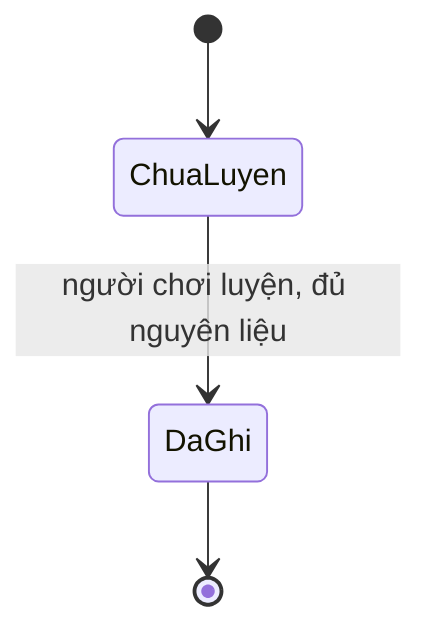

# phase-9-alchemy — Luyện một viên đan

Milestone from ROADMAP.md; rules from PRODUCT.md.
Outcome: Người chơi tiêu nguyên liệu đã có và nhận một vật phẩm dùng được.
Một lần luyện ghi nguyên liệu và thành phẩm cùng lúc. Làm lại cùng mã thì
không tạo thêm viên.

## Open decisions
- **Settled 2026-09-23 (walk) — công thức đầu:** một công thức. 3 Vân Linh
  Thảo thành 1 Tụ Khí Đan. Thảo lấy từ Hậu Sơn. Đan này là viên đã dùng khi
  đột phá.
- **Settled 2026-09-23 (walk) — thời gian luyện:** xong ngay khi bấm. Nguyên
  liệu và đan đổi trong cùng một lần ghi. Không có mẻ đang chờ.

## The flow
1. Người chơi mở Luyện Đan, thấy một công thức: 3 Vân Linh Thảo ra 1 Tụ Khí
   Đan, và số thảo đang có trong túi.
2. Nếu thảo ít hơn 3, nút luyện từ chối. Túi không đổi.
3. Người chơi luyện. Hệ thống trừ đúng 3 thảo, cộng đúng 1 đan, và lưu một
   biên nhận cùng mã yêu cầu. Việc này xong ngay.
4. Gửi lại cùng mã thì nhận lại đúng biên nhận đó. Không trừ thêm, không cộng
   thêm.
5. Mã mới, khi vẫn đủ thảo, luyện thêm một lần nữa.
6. Reload, đóng trình duyệt, restart hoặc redeploy: túi và lịch sử luyện khớp
   lần ghi.

## Entities
- **Công thức:** key, tên, nguyên liệu, số lượng nguyên liệu, thành phẩm, số
  lượng thành phẩm. Identity: key ổn định. Lát này một key `recipe/qi_pill`.
- **Biên nhận luyện:** thuộc một save, mã yêu cầu, công thức, số đã trừ, số
  đã cộng, lúc luyện. Identity: một mã yêu cầu cho một save.
- **Túi đồ:** số lượng vật phẩm đã có. Luyện chỉ đổi Vân Linh Thảo và Tụ Khí
  Đan.

## States

- PostgreSQL giữ biên nhận và số lượng trong túi. Hai thứ đổi trong một lần ghi.
- Frontend chỉ hiện công thức, số đang có và kết quả. Trình duyệt không tự trừ
  thảo hay cộng đan.

## Saved for real
- Biên nhận và số lượng sống qua reload, đóng trình duyệt, restart và redeploy.
- Save cũ không có lịch sử luyện. Migration không tự cộng đan và không tự trừ thảo.
- Mất reply rồi gửi lại cùng mã không luyện lần hai.
- Đổi cấu hình không viết lại biên nhận đã ghi.

## Resilience
| Case | Decided behaviour |
|---|---|
| Luyện hai lần, cùng mã | Một biên nhận, một lần trừ, một lần cộng. |
| Cùng mã nhưng số lượng khác | Từ chối xung đột; túi không đổi thêm. |
| Hai tab cùng luyện | Một biên nhận thắng; tab kia đọc bản đã lưu. |
| Thảo ít hơn 3 | Từ chối; không trừ, không cộng. |
| Lỗi trước khi ghi | Túi như cũ; bấm lại an toàn. |
| Mất reply sau khi ghi | Đọc lại đúng biên nhận và đúng túi. |
| Save cũ hoặc redeploy | Không tự luyện; đan và thảo đã có giữ nguyên. |
| Đột phá, trang bị, linh thú | Luyện không đổi chiến lực, tốc độ tu vi, ô trang bị hay khế ước. |

## Deferred
- Mua bán và kinh tế NPC → lộ trình nói để sau, chưa có milestone.
- Công thức thứ hai → `phase-10-partner-craft`. Luyện hỏng và luyện theo giờ
  vẫn chưa có milestone.
- Nhân giống và thú chiến đấu → vẫn chưa có milestone.

## Evidence
Automated:
- [x] E-1: Đọc được một công thức. Save chưa luyện thì không có biên nhận.
- [x] E-2: Đủ 3 thảo thì luyện một lần: thảo giảm 3, đan tăng 1.
- [x] E-3: Cùng mã trả cùng biên nhận. Cùng mã với số lượng khác bị từ chối.
- [x] E-4: Hai tab hoặc mã khác sau khi hết thảo không tạo đan thứ hai từ không khí.
- [x] E-5: Ít hơn 3 thảo thì từ chối; túi không đổi.
- [x] E-6: Lỗi trước khi ghi không trừ và không cộng; gửi lại sau đó vẫn luyện được.
- [x] E-7: Reload, restart và redeploy giữ túi và biên nhận. Migration không tự luyện.
- [x] E-8: Luyện không đổi chiến lực, tốc độ tu vi, trang bị hay linh thú.
- [x] E-9: Regression, migration, lint, typecheck và build đều qua.

Manual, at close:
- [x] E-10: Mở Luyện Đan, thấy giá 3 thảo và số đang có; luyện một lần, thấy đan mới.
- [x] E-11: Reload, xóa storage, gửi lại cùng mã: một kết quả, không nhân đan.
- [x] E-12: Desktop, mobile, 320px và bàn phím đọc được giá, số thảo và kết quả.

## Clarifications
- 2026-09-23 round 1 — asked: công thức đầu, thời gian luyện — answered:
  3 Vân Linh Thảo ra 1 Tụ Khí Đan; xong ngay — raised: none.

## Closed
Hoàn tất 2026-09-23. Backend 121 test và Playwright 34 test pass; lint,
typecheck và production build pass. Màn Luyện Đan hiện giá 3 thảo; đủ thảo
thì luyện một lần, thảo về 0 và đan tăng 1. Reload và gửi lại cùng mã không
nhân đan. 1440px, 390px và 320px không tràn ngang; nút Luyện bấm được bằng
bàn phím. Review: Ready.
